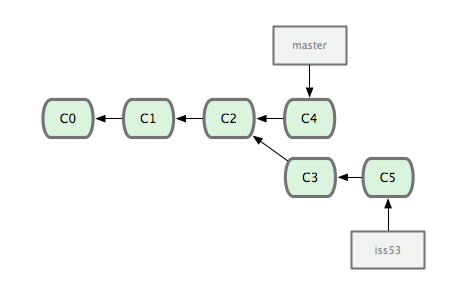
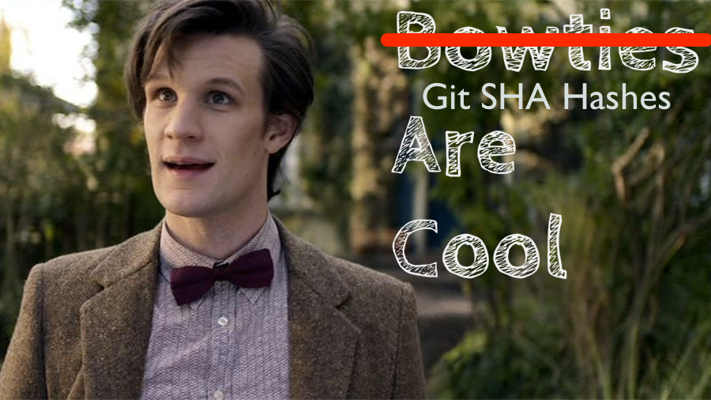

build-lists: true

---

---

# [fit] Git / Github / Teams

---

# [fit] Why do we keep versions?

---

## A story of backups.

^ Story of working at computing center, recovering PhD document
^ Everyone knows someone who's lost a file, or family photos.

---

# 3-2-1 Backup Stategy

- 3 total copies
- 2 local
- 1 offsite

^ https://www.backblaze.com/blog/the-3-2-1-backup-strategy/

---

# How does this relate to source code?

- Source code is typically small
- Mostly text (with some images and 'binary' data)

---

# History of source code control

^ History to give some perspective

---

# Manual backups

^ Deliver media to a `librarian` that would archive the media
^ Might be punch cards, tape, or early "floppy disks"

---

# OS support for multiple copies

`mycode.txt;2`

^ VMS on the VAX allowed for filenames to contain version numbers

---

# SCSS

- circa 1972
- Stores your files in an interleaved update format
- Use `scss` command to work with files (get, edit, etc.)

^ https://en.wikipedia.org/wiki/Source_Code_Control_System
^ versions only applied to a single file (e.g. one change can't span files)

---

# RCS

- More advanced version of SCSS
- Reverse updates
- Using "symbolic links" multiple people could share same version control

---

# CVS

- 1986
- Can version multiple files at once
- Can create multiple versions

---

# Why multiple versions?

- "What if"
- Supporting old versions for customers
- Working on new feature that might take a while

^ Leads to the idea of 'branches'

---

# Branches

---

# Subversion (SVN)

- Allows for remote server
- Multiple versions
- Branches
- Allows for locking

---

# Issues with SVN

- Branches store complete copies
- ".svn" folder in each directory
- Centralized, cannot work "offline", cannot make multiple versions without connecting

---

# Introduction of git

- Made by Linus Torvolds of Linux fame
- Alternative to commercial bitkeeper
- Designed to solve their problems
- Turned out to be a lot of people's problems

^ Look for Linus' git talk

---

^ If that doesn't fix it, git.txt contains the phone number of a friend of mine who understands git. Just wait through a few minutes of 'It's really pretty simple, just think of branches as...' and eventually you'll learn the commands that will fix everything.

---

# Git is a Directed Acyclic Graph

---

^ Explain why this is cool

^ Every commit has a "hash"
^ That hash is "cryptographicall secure"

---

^ Story of Linus saying he can just write down the hash of
  the linux kernel and then trust any git repo that has
  that hash. Making it such that there is no real single
  git official source of the linux kernel.

---

# Why else is git cool

- Branches are *cheap*

---

# Why else is git cool

- Branches are *fast*

---

# Why else is git cool

- Branches can just be *local*

---

# Why else is git cool

- Branches, that aren't shared, can have
  their histories *rewritten* and *compacted*

---

# Why else is git cool

- This encourages short independent branches
  where the history of the branch can be
  reoganized and cleaned up before merging
  that back into the main set of code.

---

# Why else is git cool

- You have an entire copy of the public
  repository locally so you can work
  entirely offline.

---

# Install git

---

# Configure git

- `git config --global user.name "Jane Doe"`
- `git config --global user.email janedoe@example.com`

---

# Getting started

- Basic element is the repository
- `mkdir my-first-repo`
- `cd my-first-repo`
- `git init .`

---

# Create some content

- Create file `helloworld.txt`
- Put text inside

---

# Look at the status

- `git status`

---

# Tell git to track the file

- `git add helloworld.txt`

---

# git status

^ Talk about the staging area

---

# Commit the file

- `git commit -m "Hello there world"`

---

# Second commit

- Change some text in `helloworld.txt`
- `git add helloworld.txt`
- `git commit`

^ Use the built in editor

---

# Configure for Atom

- `git config --global core.editor "atom --wait"`

---

# List of change comments

- `git log`

---

# List of changes with diffs

- `git log -p`

---

# Lets make a branch!

- `git checkout -b my-first-feature`
- `git status`

---

# Make some changes

- Edit `helloworld.txt`
- Create new file `otherfile.txt`

---

# Add/commit

- `git add helloworld.com otherfile.txt`
- `git add .`
- `git commit -m "Changes on a branch"`
  `                                     `
- `git commit -am "Changes on a branch"`

---

# Look at history

- `git log`

---

# Check out the original branch "master"

- `git checkout master`

---

# Look at history

- `git log`

---

# Undoing a change

- Make a change to `helloworld.txt`
- git checkout `helloworld.txt`
- See that the change is gone

---

# Github!

---

# Create account

---

# SSH keys

- `ls -al ~/.ssh/id_rsa.pub`
- `ssh-keygen -t rsa -b 4096 -C "your_email@example.com"`
  - Enter for filename
  - Password vs no-password
- `ssh-add ~/.ssh/id_rsa`
- `pbcopy < ~/.ssh/id_rsa.pub`
- Settings
- SSH/PGP
- New SSH Key
- Paste

---

# New Repository

- name/description
- public/private
- README
- gitignore
- license

---

# "Clone or download"

---

# .gitignore

---

# Update the README.md

- Make change to file
- `git add README.md`
- `git commit -m "Updates!"`

---

# Send our changes to github

- `git push`

^ See changes on github

---

# First pull request

- Visit https://github.com/gstark/git-crash-course
- Fork
- Clone as we did before

---

# Make a change

- Add a text file named with your name and some text
- `git add`
- `git commit -m "Comment"`
- `git push`

---

# Visit your github page for your fork

---

# Create Pull Request

- Review changes and submit

^ Look at my incoming pull requests

# Team Process
